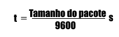

# Projeto - Entrega 2

Esta etapa do projeto consiste em encapsular e transmitir os dados do client para depois serem recebidos e desencapsulados pelo server. O encapsulamento permite que os dados sejam transmitidos de maneira mais segura e com menos perdas de bytes quando comparados com o método de streaming bruto. 

Quando é realizado o streaming bruto, há implicações quando são transmitidos arquivos pesados e/ou múltiplos, causando junções indesejadas dos arquivos em questão (como por exemplo a fusão dos bytes de duas imagens independentes)

## Encapsulamento

O encapsulamento delimita o arquivo com a utilização de um HEAD e um end of package (EOP), impedindo que fusões indesejadas de arquivos ocorram.

## HEAD e EOP

O head possui 3 bytes reservados, sendo os 2 primeiros de inicialização e o último com o tamanho do arquivo que será empacotado.

O EOP é composto por apenas 1 byte, ou seja, 8 bits que garantem que o payload seja enviado por completo.

## Overhead
 
O overhead é calculado é calculado pela razão do tamanho total do pacote pelo tamanho da carga do arquivo (carga útil), ou seja:

## Tempo de transmissão

O tempo é calculado por:

## Throughput 

É a velocidade de envio dos dados, calculado por:

