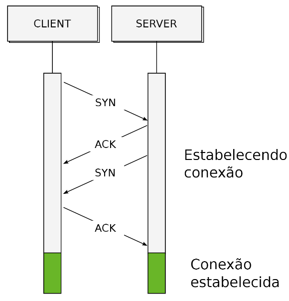

# Projeto - Entrega 3

Esta etapa do projeto consiste em implementar o protocolo de handshake na camada enlace. Desta forma, o protocolo só permite que o <i>client</i> envie dados quando o <i>server</i> estiver habilitado para receber.
Também foi implementado o protocolo ACK-NACK, que avalia o estado do pacote recebido pelo <i>server</i>. Caso o pacote esteja corrompido ou incompleto, será realizado um novo envio.

## Handshake

A conexão é estabelecida quando o client envia um pacote com o comando SYN para o serve, que deve responder, em um intervalo de tempo definido, com um outro pacote com comando SYN e um pacote com comando ACK, avisando que o SYN enviado pelo client foi recebido com sucesso. O client deve, então, responder com um ACK para que os arquivos ou dados comecem a ser transmitidos.

O procedimento do handshake pode ser visualizado no diagrama abaixo:

## Pacotes de comando

Os pacotes utilizados foram

<strong>-Head:</strong> start (8 bits), size (16 bits), SYN (8 bits), ACK/nACK (8 bits).
<strong>-EOP:</strong> s.t.o.p. (8 bits)

O tipo dos pacotes foi definido como

<strong>-SYN:</strong> sincronismo (0x01)
<strong>-ACK:</strong> reconhecimento (0x9d)
<strong>-nACK:</strong> não reconhecimento (0x0e)

## Diagramação como máquina de estados

A máquina de estados basicamante avalia o <strong>estado atual</strong> tanto do client quanto do server e as ações que serão tomadas são baseadas nestes estados. As alterações dependem das respostas recebidas tanto pelo server quanto pelo client e pelo tempo tomado para receber as respectivas respostas.

#### Diagrama do client:

### Diagrama do server:

## Time out

O tempo de timeout escolhido foi de 6s. O envio e recepção não são istantâneos e algumas partes do código demoram para rodar (prints) e quisemos ter uma margem de segurança. Contudo, temos ciência que 6 segundos é um tempo de timeout alto.

## Reconhecimento do pacote recebido

O reconhecimento ocorre pela checagem do tamanho enviado pelo head (size) é igual ao tamanho do payload. Caso não for, um novo envio é iniciado.

